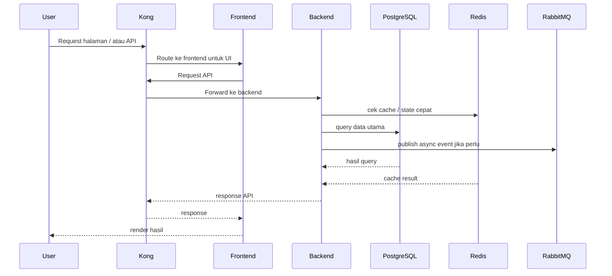
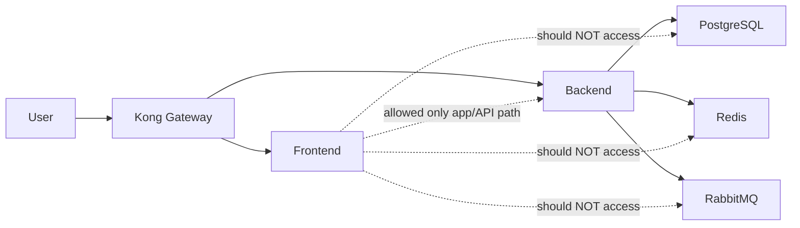

# Final Architecture Presentation — KerjaDekat on Minikube

## 1. Ringkasan Eksekutif

Dokumen ini menjelaskan arsitektur final proyek KerjaDekat yang dijalankan sepenuhnya di lingkungan lokal menggunakan Minikube, tetapi dirancang mengikuti prinsip cloud architecture yang well-architected, secure-by-design, observable, dan scalable.

Walaupun deployment dilakukan secara lokal, desain sistem tetap meniru pola arsitektur cloud modern, yaitu:
- pemisahan layer akses publik, aplikasi, data, dan operasional
- penggunaan API Gateway sebagai single entry point
- isolasi komunikasi service dengan pendekatan zero-trust
- deployment deklaratif dengan GitOps menggunakan ArgoCD
- autoscaling dengan Horizontal Pod Autoscaler (HPA)
- observability dengan Prometheus dan Grafana
- messaging layer terpisah dengan RabbitMQ
- cache layer terpisah dengan Redis
- database layer terisolasi dengan PostgreSQL + PostGIS

Tujuan utamanya bukan hanya agar aplikasi berjalan, tetapi juga agar arsitekturnya layak dijadikan simulasi sistem cloud yang aman dan profesional untuk konteks mata kuliah Cloud Computing / DevOps.

---

## 2. Tujuan Arsitektur

Arsitektur ini dirancang untuk memenuhi tujuan berikut:

1. Menjalankan seluruh stack secara lokal di Minikube
2. Meniru pola arsitektur cloud production-grade
3. Memastikan frontend tidak menjadi jalur langsung ke database
4. Menjadikan backend sebagai satu-satunya service yang boleh mengakses data tier
5. Menyediakan jalur deployment yang deklaratif dan reproducible lewat GitOps
6. Mendemonstrasikan autoscaling menggunakan HPA dan load test k6
7. Menyediakan monitoring dan health visibility untuk semua komponen penting

---

## 3. Prinsip Desain yang Dipakai

### 3.1 Secure by Design
Sistem didesain dengan asumsi bahwa semua komunikasi antar komponen harus dibatasi secara eksplisit. Tidak ada komponen yang otomatis dipercaya.

### 3.2 Least Privilege
Setiap komponen hanya diberi akses yang benar-benar dibutuhkan.
Contoh:
- frontend hanya melayani UI
- backend mengakses database, Redis, dan RabbitMQ
- database tidak diekspos ke user/public

### 3.3 Single Entry Point
Seluruh trafik masuk diarahkan melalui Kong API Gateway.
Ini membuat kontrol routing, ekspose endpoint, dan boundary akses jadi lebih terstruktur.

### 3.4 Layered Architecture
Sistem dipisahkan menjadi beberapa zona logis agar mudah dijelaskan seperti arsitektur cloud:
- edge layer
- application layer
- data layer
- operations layer

### 3.5 Declarative Infrastructure
Deployment dilakukan menggunakan manifest Kubernetes dan ArgoCD, sehingga perubahan infrastruktur bisa dilacak dari Git.

### 3.6 Elasticity Demonstration
HPA dipakai untuk menunjukkan bahwa workload dapat naik-turun mengikuti beban.

---

## 4. Arsitektur Logis Final

### 4.1 Edge Layer
Komponen:
- Kong API Gateway

Fungsi:
- menjadi pintu masuk utama untuk request user
- meneruskan request frontend dan backend
- memusatkan boundary antara dunia luar dan cluster internal

### 4.2 Application Layer
Komponen:
- kerjadekat-frontend
- kerjadekat-backend

Fungsi frontend:
- menyajikan UI KerjaDekat kepada user
- mengirim request API ke backend melalui gateway
- tidak mengakses database secara langsung

Fungsi backend:
- menyediakan API bisnis utama
- menjadi penghubung resmi ke PostgreSQL, Redis, dan RabbitMQ
- menangani health endpoint dan logic aplikasi

### 4.3 Data Layer
Komponen:
- PostgreSQL + PostGIS
- Redis
- RabbitMQ

Fungsi:
- PostgreSQL: penyimpanan data utama
- Redis: cache / fast-access store
- RabbitMQ: asynchronous messaging / queue

Prinsip utama:
- data layer tidak boleh diakses langsung oleh frontend
- akses ke data tier seharusnya dibatasi hanya untuk backend

### 4.4 Operations Layer
Komponen:
- ArgoCD
- Prometheus
- Grafana
- Elasticsearch/logging components

Fungsi:
- ArgoCD: GitOps deployment controller
- Prometheus: metrics collection
- Grafana: visualisasi monitoring
- Logging: observability tambahan

---

## 5. Mapping “Cloud-like Subnet” ke Kubernetes Lokal

Walaupun Minikube tidak memiliki subnet cloud asli seperti di AWS/Azure, konsep subnet dapat dimodelkan secara logis sebagai berikut:

### Public / Edge Zone
Diwakili oleh:
- Kong namespace / service ingress boundary

Makna:
- semua trafik dari luar harus melewati zona ini

### Private App Zone
Diwakili oleh:
- namespace `kerjadekat`
- frontend dan backend deployments

Makna:
- service aplikasi berjalan di sini
- tidak langsung terekspos ke internet kecuali lewat Kong

### Restricted Data Zone
Diwakili oleh:
- namespace `kerjadekat-infra`
- PostgreSQL, Redis, RabbitMQ

Makna:
- zona paling sensitif
- idealnya hanya backend yang boleh masuk

### Operations / Management Zone
Diwakili oleh:
- namespace `argocd`
- namespace `monitoring`
- namespace `logging`

Makna:
- area operasional dan observability
- dipisahkan dari jalur request user biasa

---

## 6. Flowchart Arsitektur — Mermaid

Berikut flowchart Mermaid yang bisa langsung kamu pakai di Markdown viewer yang support Mermaid.

```mermaid
flowchart TD
    U[User / Browser] --> K[Kong API Gateway]

    subgraph APP_NS[Namespace: kerjadekat]
        F[Frontend Pod(s)]
        B[Backend Pod(s)]
        HPA1[HPA Frontend]
        HPA2[HPA Backend]
    end

    subgraph INFRA_NS[Namespace: kerjadekat-infra]
        PG[PostgreSQL + PostGIS]
        R[Redis]
        MQ[RabbitMQ]
    end

    subgraph OPS_NS[Operations]
        A[ArgoCD]
        P[Prometheus]
        G[Grafana]
        L[Logging / Elasticsearch]
    end

    U -->|HTTP| K
    K -->|Route /| F
    K -->|Route /api/*| B
    K -->|Route /ws| B

    F -->|API calls| B
    B -->|SQL| PG
    B -->|Cache| R
    B -->|Async Messaging| MQ

    P -->|scrape metrics| B
    P -->|scrape metrics| F
    P -->|scrape metrics| PG
    P -->|scrape metrics| MQ
    G -->|visualize| P

    A -->|sync manifests from Git| APP_NS
    A -->|sync manifests from Git| INFRA_NS

    HPA1 -->|scale frontend| F
    HPA2 -->|scale backend| B
```

---

## 7. Flowchart Request User — Mermaid



---

## 8. Flowchart Security Boundary — Mermaid



Catatan penting untuk presentasi:
- Secara desain, frontend tidak boleh mengakses PostgreSQL, Redis, atau RabbitMQ secara langsung.
- NetworkPolicy baseline sudah dibuat untuk mewujudkan ini.
- Namun pada environment Minikube Docker driver yang digunakan saat pengujian, enforcement policy belum berjalan penuh karena keterbatasan CNI lokal.
- Jadi desain security sudah benar, tetapi enforcement lokal tidak sekuat cluster dengan CNI policy-aware yang proper.

---

## 9. Komponen yang Berhasil Dijalankan

Komponen aplikasi:
- frontend
- backend

Komponen data:
- PostgreSQL
- Redis
- RabbitMQ

Komponen platform:
- Kong API Gateway
- ArgoCD
- Prometheus
- Grafana
- Logging/Elasticsearch

---

## 10. GitOps Architecture

Arsitektur deployment memakai model GitOps dengan ArgoCD.

Alur sederhananya:
1. manifest Kubernetes disimpan di repository Git
2. ArgoCD membaca repository tersebut
3. ArgoCD melakukan sinkronisasi manifest ke cluster
4. cluster state dijaga agar mengikuti desired state di Git

Keuntungan pendekatan ini:
- perubahan terdokumentasi
- reproducible
- mudah diaudit
- cocok untuk best practice DevOps modern

Untuk local dev, mode sync dibuat manual agar perubahan tidak terlalu agresif selama debugging.

---

## 11. HPA dan Demonstrasi Autoscaling

HPA yang aktif:
- frontend HPA
- backend HPA

Konfigurasi inti:
- frontend min replicas: 2
- frontend max replicas: 10
- backend min replicas: 2
- backend max replicas: 6

### Hasil pengujian k6

Pengujian load test dilakukan menggunakan k6.

Hasil penting:
- total request: 272,785
- throughput: 909 req/s
- error rate: 0%
- average latency: 10.37 ms
- p95 latency: 27.02 ms
- max virtual users: 80

### Perilaku autoscaling yang teramati
- frontend berhasil scale dari 2 pod ke 10 pod
- backend tetap 2 pod karena CPU backend tidak melewati threshold scale-out
- setelah load selesai, HPA scale down kembali ke baseline 2 replicas

Kesimpulan:
- fitur autoscaling berhasil dibuktikan berjalan
- sistem dapat merespons lonjakan beban tanpa error request

---

## 12. Security Baseline yang Sudah Dibuat

Sudah dibuat manifest NetworkPolicy baseline yang mencakup:
- default deny untuk namespace aplikasi
- default deny untuk namespace infrastruktur
- allow DNS egress
- allow Kong ke frontend
- allow Kong ke backend
- allow frontend ke backend
- allow backend ke PostgreSQL
- allow backend ke Redis
- allow backend ke RabbitMQ

### Keterbatasan implementasi lokal
Meskipun policy sudah benar secara desain, enforcement penuh belum berhasil ditunjukkan di cluster Minikube saat ini.

Artinya:
- desain security valid
- implementasi runtime di local environment masih terbatas
- pada cluster dengan CNI yang benar-benar enforce NetworkPolicy, desain ini akan lebih akurat direalisasikan

Ini penting untuk dijelaskan secara jujur saat presentasi.

---

## 13. Observability

Monitoring stack yang aktif:
- Prometheus
- Grafana

Fungsi utama:
- melihat CPU/memory usage pod
- melihat dampak load test terhadap HPA
- menjadi dasar pembuktian bahwa autoscaling benar-benar terjadi

Logging stack:
- Elasticsearch/logging layer tersedia sebagai bagian observability tambahan

---

## 14. Nilai Well-Architected dari Proyek Ini

Kalau dijelaskan dengan bahasa sederhana, proyek ini sudah mendekati arsitektur cloud yang baik karena:

1. Ada pemisahan tanggung jawab
   - gateway, app, data, ops dipisah jelas

2. Ada jalur masuk tunggal
   - semua request masuk dari Kong

3. Ada kontrol deployment modern
   - GitOps dengan ArgoCD

4. Ada observability
   - Prometheus + Grafana

5. Ada scalability
   - HPA + k6 proof

6. Ada security baseline
   - zero-trust style policy sudah dirancang

7. Ada reproducibility
   - semua komponen didefinisikan sebagai manifest

---

## 15. Batasan dan Trade-off

Agar presentasi kamu matang, bagian ini penting disampaikan juga.

### Batasan
1. lingkungan masih single-node local cluster
2. tidak ada cloud load balancer asli
3. tidak ada subnet/VNet/VPC asli
4. enforcement NetworkPolicy terbatas oleh CNI lokal
5. belum ada high availability antarnode karena cluster hanya lokal

### Trade-off
- lebih murah dan sederhana untuk pengembangan / pembelajaran
- cukup kuat untuk simulasi arsitektur cloud
- belum sepenuhnya identik dengan production multi-node cloud

---

## 16. Rekomendasi Pengembangan Berikutnya

Jika proyek ini ingin ditingkatkan lagi, prioritas berikutnya adalah:

1. Recreate Minikube dengan CNI yang enforce NetworkPolicy sejak awal
2. Tambahkan securityContext:
   - runAsNonRoot
   - readOnlyRootFilesystem
   - allowPrivilegeEscalation: false
   - drop capabilities
3. Tambahkan ResourceQuota dan LimitRange per namespace
4. Tambahkan PodDisruptionBudget
5. Tambahkan Secret hardening
6. Tambahkan dashboard Grafana khusus HPA demo
7. Tambahkan pipeline CI yang update image/tag otomatis ke GitOps repo

---

## 17. Narasi Presentasi Singkat

Berikut versi narasi yang bisa kamu ucapkan saat presentasi:

“Pada proyek KerjaDekat, saya membangun simulasi arsitektur cloud yang dijalankan sepenuhnya di lingkungan lokal menggunakan Minikube. Walaupun tidak memakai AWS atau Azure secara langsung, arsitektur yang saya buat tetap mengikuti pola cloud modern, yaitu memisahkan edge layer, application layer, data layer, dan operations layer.

Semua trafik dari user masuk terlebih dahulu ke Kong API Gateway. Dari sana, request diarahkan ke frontend atau backend. Frontend hanya melayani antarmuka pengguna, sedangkan backend menjadi satu-satunya service yang berkomunikasi dengan PostgreSQL, Redis, dan RabbitMQ.

Untuk deployment, saya menggunakan pendekatan GitOps dengan ArgoCD, sehingga seluruh desired state cluster disimpan di repository Git dan bisa disinkronkan secara deklaratif ke Kubernetes. Untuk monitoring, saya menggunakan Prometheus dan Grafana.

Di sisi scalability, saya mengaktifkan Horizontal Pod Autoscaler dan melakukan load test menggunakan k6. Hasilnya, frontend berhasil melakukan scale dari 2 pod menjadi 10 pod ketika menerima lonjakan beban, dan kemudian scale down kembali setelah beban turun. Ini membuktikan bahwa arsitektur yang saya bangun tidak hanya berjalan, tetapi juga responsif terhadap load.

Di sisi security, saya sudah mendefinisikan baseline NetworkPolicy agar frontend tidak dapat mengakses database secara langsung, dan hanya backend yang boleh masuk ke data layer. Secara desain ini sudah sesuai prinsip zero-trust. Namun, karena environment lokal Minikube yang digunakan memiliki keterbatasan di layer CNI, enforcement policy belum sepenuhnya aktif. Jadi ini menjadi salah satu catatan penting bahwa desain arsitektur sudah secure-by-design, tetapi local runtime environment masih punya keterbatasan dibanding cluster production.”

---

## 18. Narasi Presentasi Panjang

“Tujuan utama proyek ini adalah membuktikan bahwa walaupun deployment dilakukan secara lokal, kita tetap bisa merancang sistem yang menyerupai arsitektur cloud modern. Karena itu, saya tidak hanya fokus membuat aplikasi berjalan, tetapi juga mendesain boundary antar layer, security baseline, autoscaling, observability, dan deployment automation.

Saya membagi sistem menjadi empat zona logis. Zona pertama adalah edge layer yang diwakili oleh Kong API Gateway. Semua trafik dari user harus melewati Kong terlebih dahulu. Zona kedua adalah application layer yang terdiri dari frontend dan backend. Zona ketiga adalah data layer yang berisi PostgreSQL, Redis, dan RabbitMQ. Zona keempat adalah operations layer yang berisi ArgoCD, Prometheus, Grafana, dan logging stack.

Dengan pembagian ini, arsitektur menjadi lebih mudah dijelaskan dan lebih mirip dengan konsep public subnet, private app subnet, dan restricted data subnet di cloud. Meskipun Kubernetes lokal tidak punya subnet cloud asli, konsep isolasi ini tetap bisa dimodelkan dengan namespace, ingress boundary, service internal, dan NetworkPolicy.

Untuk deployment management, saya menggunakan ArgoCD dengan pendekatan GitOps. Artinya, manifest Kubernetes didefinisikan di Git, lalu ArgoCD bertugas menjaga agar state di cluster selalu mengikuti state yang ada di repository. Ini penting karena membuat perubahan infrastruktur menjadi lebih repeatable dan lebih mudah diaudit.

Dari sisi kinerja, saya mengaktifkan Horizontal Pod Autoscaler. Saya lalu menggunakan k6 untuk memberikan beban secara bertahap sampai puluhan virtual user. Hasil pengujian menunjukkan bahwa frontend mampu scale dari 2 pod menjadi 10 pod ketika CPU usage melewati threshold yang ditentukan. Setelah beban turun, jumlah pod secara bertahap kembali turun. Ini menunjukkan bahwa mekanisme autoscaling benar-benar bekerja.

Dari sisi security, saya membuat NetworkPolicy baseline yang pada level desain sudah membatasi jalur komunikasi. Kong hanya boleh berbicara dengan frontend dan backend. Frontend hanya boleh mengakses backend. Backend yang diizinkan mengakses PostgreSQL, Redis, dan RabbitMQ. Dengan begitu, database tidak menjadi komponen yang bisa dijangkau langsung dari sisi frontend. Ini mengikuti prinsip least privilege dan zero-trust.

Namun, ada satu temuan penting pada environment lokal ini, yaitu enforcement NetworkPolicy belum berjalan penuh karena keterbatasan CNI pada setup Minikube Docker driver yang digunakan. Jadi, kesimpulan teknisnya adalah arsitektur dan policy sudah benar, tetapi runtime lokal belum bisa sepenuhnya membuktikan isolasi yang sama kuat seperti cluster production dengan CNI yang tepat. Ini menjadi pembelajaran penting bahwa security bukan hanya soal manifest Kubernetes, tetapi juga bergantung pada kapabilitas network plugin di cluster.”

---

## 19. Kalimat Penutup Presentasi

“Jadi, hasil akhir proyek ini menunjukkan bahwa Minikube lokal tetap bisa dipakai untuk mensimulasikan arsitektur cloud yang terstruktur, scalable, observable, dan secure-by-design. Walaupun ada keterbatasan enforcement pada environment lokal, prinsip arsitektur yang dibangun sudah mengikuti praktik yang relevan dengan cloud-native systems.”

---

## 20. File Pendukung Terkait

- `PANDUAN_MINIKUBE.md`
- `SECURE_MINIKUBE_ARCHITECTURE_PLAN.md`
- `gitops/base/network-policies/baseline-network-policies.yaml`
- `k6-hpa-loadtest.js`
- `watch-hpa.sh`

---

Dokumen ini siap dipakai sebagai dasar laporan maupun presentasi lisan.
