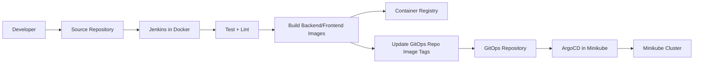
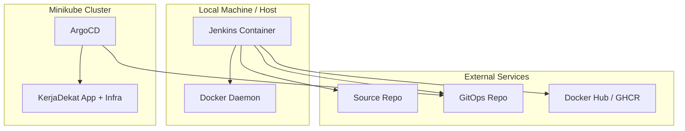
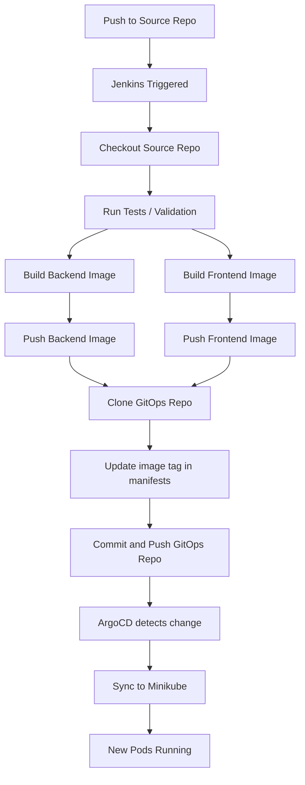
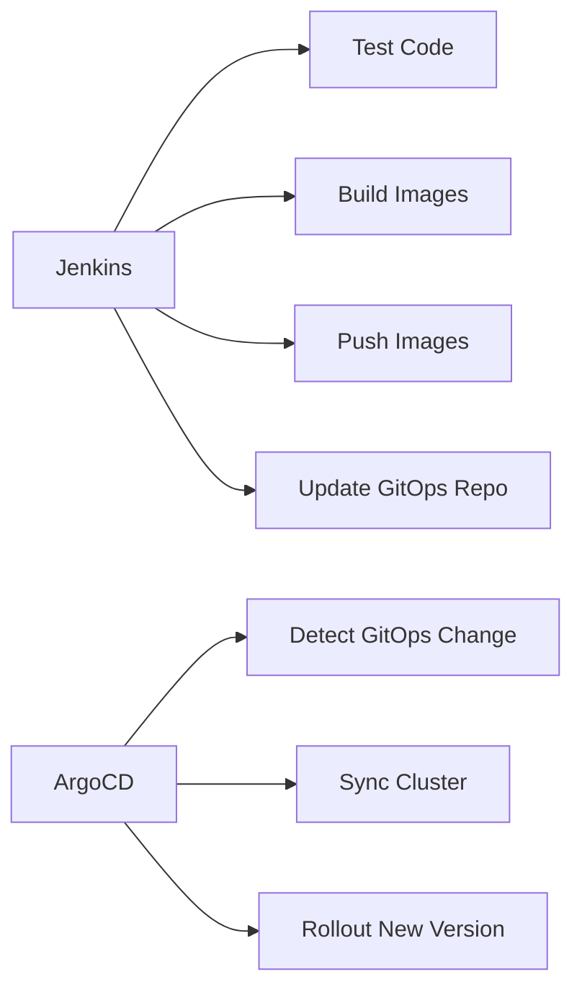

# Jenkins Option C Blueprint

> Jenkins berjalan di Docker host, ArgoCD berjalan di Minikube, deployment tetap GitOps.

## 1. Tujuan Blueprint

Blueprint ini mendesain alur CI/CD yang rapi dan production-like untuk proyek KerjaDekat dengan pola:

1. Developer push code ke source repository
2. Jenkins menjalankan CI
3. Jenkins build image backend dan frontend
4. Jenkins push image ke registry
5. Jenkins update image tag di GitOps repo
6. ArgoCD mendeteksi perubahan di GitOps repo
7. ArgoCD sync ke Minikube

Dengan pola ini:
- Jenkins = CI
- ArgoCD = CD/GitOps deploy controller
- Git = source of truth

---

## 2. Arsitektur Tingkat Tinggi

Komponen utama:
- Source Repo: kode aplikasi backend/frontend
- GitOps Repo: manifest Kubernetes / image tags
- Jenkins: CI server di Docker host
- Registry: Docker Hub atau GHCR
- ArgoCD: deployment controller di Minikube
- Minikube: runtime cluster lokal

### Mermaid — High-Level CI/CD Flow

---

## 3. Posisi Jenkins di Sistem

Jenkins tidak dijalankan di dalam Minikube.
Jenkins dijalankan sebagai container Docker di host lokal.

Alasan memilih ini:
- lebih ringan untuk laptop
- lebih mudah untuk pemula
- tidak membebani cluster aplikasi
- lebih mudah akses Docker daemon host
- lebih cocok untuk pipeline build image

### Mermaid — Infra Placement

---

## 4. Repo Strategy

Ada 2 repo yang sebaiknya dipertahankan terpisah.

### Repo A — Source Repository
Berisi:
- backend code
- frontend code
- test
- Dockerfile source app bila perlu
- Jenkinsfile

Contoh isi:
- `/backend`
- `/frontend`
- `/Jenkinsfile`

### Repo B — GitOps Repository
Berisi:
- manifest Kubernetes
- deployment yaml
- service yaml
- ingress yaml
- HPA yaml
- network policy yaml
- image tag yang ingin dideploy

Contoh isi:
- `gitops/base/backend/deployment.yaml`
- `gitops/base/frontend/deployment.yaml`

Prinsipnya:
- source repo = tempat development
- GitOps repo = desired state deployment

---

## 5. Registry Strategy

Rekomendasi paling praktis untuk kamu:
- Docker Hub

Alasan:
- kamu sudah punya akun Docker Hub
- paling mudah dijelaskan di presentasi
- Jenkins gampang push ke sana
- ArgoCD/Minikube gampang pull dari sana

Alternatif:
- GHCR

Tapi untuk kesederhanaan implementasi awal, Docker Hub lebih enak.

---

## 6. Credential yang Dibutuhkan

Jenkins akan butuh beberapa credential.

### 6.1 GitHub Source Repo Credential
Tujuan:
- clone source repo

Bisa pakai:
- Personal Access Token, atau
- SSH key

Rekomendasi pemula:
- Personal Access Token dulu

### 6.2 Docker Hub Credential
Tujuan:
- login dan push image

Isi:
- username Docker Hub
- password / access token Docker Hub

### 6.3 GitOps Repo Credential
Tujuan:
- clone GitOps repo
- commit perubahan tag image
- push kembali ke GitOps repo

Bisa pakai:
- PAT GitHub
- atau SSH key deploy key

### 6.4 Optional: Webhook Secret
Tujuan:
- trigger Jenkins otomatis saat ada push

---

## 7. Naming Convention yang Disarankan

Agar pipeline rapi, pakai naming seperti ini.

### Jenkins Credentials IDs
- `github-source-token`
- `github-gitops-token`
- `dockerhub-creds`

### Docker Images
- `ghalitsar/kerjadekat-backend:<tag>`
- `ghalitsar/kerjadekat-frontend:<tag>`

### Tag Strategy
Pilih salah satu:

1. `latest` only
- paling mudah
- kurang bagus untuk audit

2. `build-number`
- contoh: `backend:jenkins-42`
- lebih jelas

3. `git-sha`
- contoh: `backend:1fc73d8`
- paling bagus untuk traceability

Rekomendasi saya:
- gunakan short git SHA

Contoh:
- `ghalitsar/kerjadekat-backend:1fc73d8`
- `ghalitsar/kerjadekat-frontend:1fc73d8`

---

## 8. Flow Pipeline Detail

### Stage 1 — Checkout Source Code
Jenkins clone source repo.

### Stage 2 — Static Validation
Contoh:
- backend lint/test
- frontend build check

### Stage 3 — Build Images
Jenkins build:
- backend image
- frontend image

### Stage 4 — Push Images
Jenkins login ke Docker Hub lalu push image.

### Stage 5 — Update GitOps Repo
Jenkins:
- clone GitOps repo
- ganti image tag di deployment manifests
- commit
- push

### Stage 6 — ArgoCD Sync
ArgoCD membaca perubahan GitOps repo dan deploy ke Minikube.

### Mermaid — Detailed Pipeline

---

## 9. Batas Tanggung Jawab Jenkins vs ArgoCD

Ini penting untuk dijaga supaya arsitekturnya bersih.

### Jenkins Bertanggung Jawab Untuk:
- build
- test
- publish image
- update repo GitOps

### Jenkins Tidak Bertanggung Jawab Untuk:
- `kubectl apply` langsung ke cluster
- deploy langsung ke Minikube
- memodifikasi runtime cluster secara imperatif

### ArgoCD Bertanggung Jawab Untuk:
- membaca desired state dari GitOps repo
- menyinkronkan cluster ke desired state
- menjadi deployment controller tunggal

Ini adalah inti GitOps yang benar.

---

## 10. Opsi Trigger Pipeline

### Opsi A — Manual Build
Kamu klik build di Jenkins.

Kelebihan:
- paling sederhana
- bagus untuk awal setup

### Opsi B — GitHub Webhook
Push ke source repo langsung trigger Jenkins.

Kelebihan:
- otomatis
- lebih real CI/CD

Rekomendasi implementasi bertahap:
1. mulai manual dulu
2. setelah stabil, aktifkan webhook

---

## 11. Struktur Jenkinsfile yang Disarankan

Jenkinsfile nanti sebaiknya punya stage seperti ini:

1. Checkout
2. Validate Backend
3. Validate Frontend
4. Build Backend Image
5. Build Frontend Image
6. Docker Login
7. Push Backend Image
8. Push Frontend Image
9. Clone GitOps Repo
10. Update Backend Image Tag
11. Update Frontend Image Tag
12. Commit & Push GitOps Repo
13. Summary

---

## 12. File yang Kemungkinan Akan Diubah

### Di Source Repo
- `Jenkinsfile`
- mungkin `.dockerignore`
- mungkin Dockerfile backend/frontend bila perlu penyesuaian final

### Di GitOps Repo
- `gitops/base/backend/deployment.yaml`
- `gitops/base/frontend/deployment.yaml`

Agar update tag mudah, format image line harus stabil.

Contoh:
- `image: ghalitsar/kerjadekat-backend:1fc73d8`
- `image: ghalitsar/kerjadekat-frontend:1fc73d8`

---

## 13. Strategi Update Manifest GitOps

Ada 2 cara umum.

### Cara 1 — Replace langsung baris image
Contoh:
- cari `image: ghalitsar/kerjadekat-backend:*`
- ganti dengan tag baru

Kelebihan:
- simpel
- cocok untuk awal

### Cara 2 — Kustomize / values file
Contoh:
- tag disimpan di file terpisah
- Jenkins cuma update values/tag file

Kelebihan:
- lebih bersih

Rekomendasi awal:
- mulai dari replace langsung dulu karena lebih mudah dipahami

---

## 14. Security Considerations

Karena Jenkins di Docker akan build image, pendekatan paling sederhana adalah mount Docker socket:
- `/var/run/docker.sock:/var/run/docker.sock`

Ini powerful dan ada risiko security.

Untuk local lab/tugas kuliah, ini masih wajar.
Tapi harus dijelaskan bahwa:
- Jenkins punya akses tinggi ke Docker host
- ini cocok untuk local dev/lab, bukan desain paling aman untuk production

Best-practice local statement:
- acceptable for local CI lab setup
- not ideal for hardened production environment

---

## 15. Resource Considerations

Karena Jenkins jalan di host Docker, kamu perlu memperhitungkan resource laptop.

Komponen yang aktif:
- Minikube
- PostgreSQL
- Redis
- RabbitMQ
- Kong
- ArgoCD
- Monitoring
- Jenkins container

Saran:
- hindari build paralel dulu
- cukup sequential pipeline
- gunakan image cleanup berkala bila disk mulai penuh

---

## 16. Rencana Implementasi Bertahap

### Phase 1 — Jenkins Bootstrap
- jalankan Jenkins di Docker
- persist volume Jenkins home
- mount docker.sock
- akses UI Jenkins

### Phase 2 — Jenkins Basic Setup
- install plugin dasar
- buat admin
- tambah credentials GitHub dan Docker Hub

### Phase 3 — Source Pipeline
- buat Jenkinsfile
- test checkout source repo
- test build backend/frontend tanpa push dulu

### Phase 4 — Registry Integration
- docker login dari Jenkins
- push image ke Docker Hub

### Phase 5 — GitOps Update
- clone GitOps repo di pipeline
- update tag image
- commit dan push

### Phase 6 — ArgoCD Verification
- cek ArgoCD membaca perubahan
- cek rollout pod baru

### Phase 7 — Automation Hardening
- optional webhook
- optional branch filter
- optional approval gate

---

## 17. Acceptance Criteria

Blueprint ini dianggap berhasil jika semua poin berikut tercapai:

1. Jenkins bisa jalan di Docker host
2. Jenkins bisa checkout source repo
3. Jenkins bisa build backend image
4. Jenkins bisa build frontend image
5. Jenkins bisa push kedua image ke Docker Hub
6. Jenkins bisa update image tag di GitOps repo
7. ArgoCD mendeteksi perubahan repo GitOps
8. Minikube menjalankan image baru hasil pipeline

---

## 18. Risiko dan Mitigasi

### Risiko 1 — Build frontend gagal di Jenkins
Mitigasi:
- samakan Dockerfile yang sudah terbukti jalan lokal
- test build manual dulu dari Jenkins host

### Risiko 2 — GitOps repo gagal di-push
Mitigasi:
- gunakan token yang benar
- test clone/push manual dulu

### Risiko 3 — ArgoCD tidak sync
Mitigasi:
- verifikasi app repoURL benar
- verifikasi path manifest benar
- sync manual dulu saat tahap awal

### Risiko 4 — Resource laptop penuh
Mitigasi:
- limit HPA
- jangan jalankan load test bersamaan saat setup Jenkins
- cleanup image lama

### Risiko 5 — Jenkins docker.sock terlalu powerful
Mitigasi:
- pahami ini hanya untuk lab/local dev
- dokumentasikan trade-off

---

## 19. Narasi Presentasi Singkat

“Pada arsitektur CI/CD final, Jenkins berperan sebagai Continuous Integration server yang berjalan di Docker host lokal. Jenkins bertugas mengambil source code, menjalankan validasi, membangun image backend dan frontend, lalu mendorong image tersebut ke registry. Setelah itu Jenkins mengupdate GitOps repository dengan tag image terbaru. ArgoCD yang berjalan di Minikube kemudian mendeteksi perubahan di GitOps repository dan melakukan sinkronisasi deployment ke cluster. Dengan pola ini, Jenkins tidak melakukan deployment langsung ke Kubernetes, sehingga prinsip GitOps tetap terjaga.”

---

## 20. Mermaid — Responsibility Split

---

## 21. Keputusan Rekomendasi Final

Untuk implementasi awal yang paling seimbang antara sederhana dan profesional:

- Jenkins berjalan di Docker host
- Docker Hub sebagai registry
- ArgoCD tetap di Minikube
- Source repo dan GitOps repo tetap terpisah
- Jenkins update tag image secara langsung di GitOps deployment YAML
- Trigger pipeline dimulai manual dulu, baru webhook setelah stabil

---

## 22. Next Step Setelah Blueprint

Langkah berikutnya yang paling masuk akal:

1. Setup Jenkins container di Docker
2. Login awal dan install plugin yang dibutuhkan
3. Buat credentials GitHub + Docker Hub
4. Tulis Jenkinsfile v1
5. Test backend build
6. Test frontend build
7. Tambahkan stage update GitOps repo
8. Verifikasi ArgoCD sync

Jika kamu setuju, langkah berikutnya adalah implementasi fase 1: bootstrap Jenkins di Docker.
