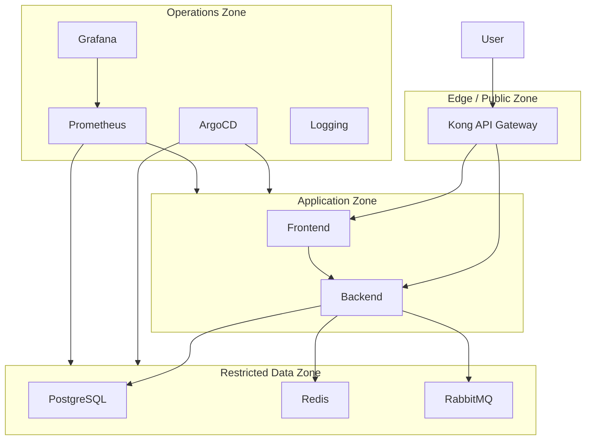
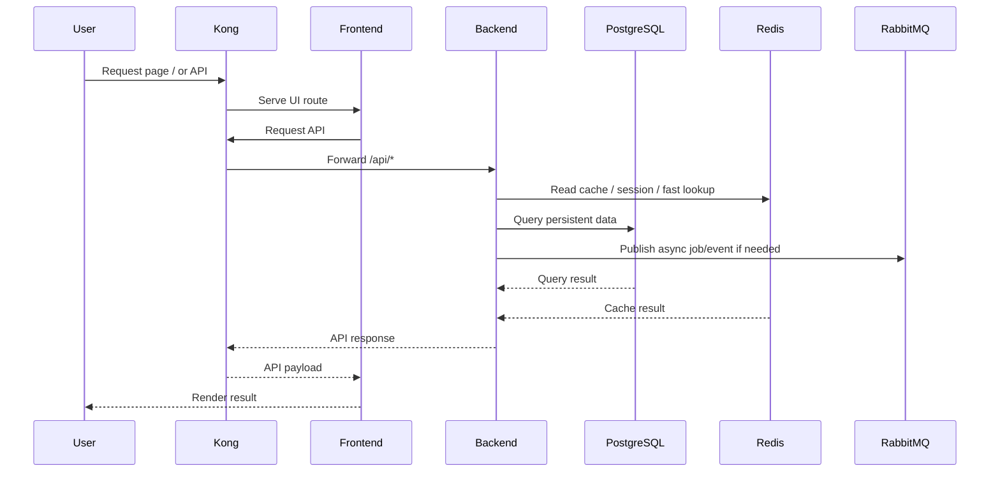
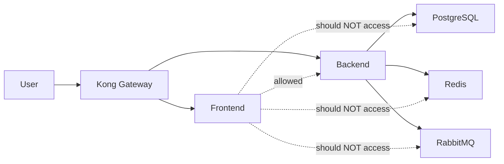
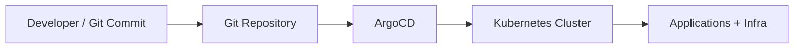
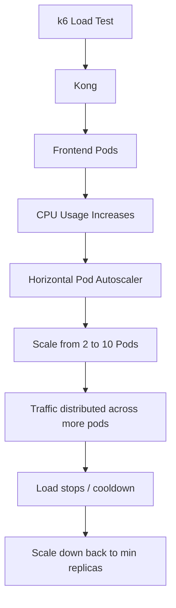
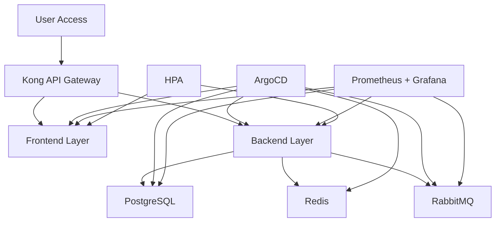

# KerjaDekat Architecture Diagrams (Mermaid)

## 1. High-Level Architecture

```mermaid
flowchart TD
    U[User / Browser] --> K[Kong API Gateway]

    subgraph APP_NS[Namespace: kerjadekat]
        F[Frontend Pod(s)]
        B[Backend Pod(s)]
        HPA1[HPA Frontend]
        HPA2[HPA Backend]
    end

    subgraph INFRA_NS[Namespace: kerjadekat-infra]
        PG[PostgreSQL + PostGIS]
        R[Redis]
        MQ[RabbitMQ]
    end

    subgraph OPS_NS[Operations Layer]
        A[ArgoCD]
        P[Prometheus]
        G[Grafana]
        L[Logging / Elasticsearch]
    end

    U -->|HTTP| K
    K -->|Route /| F
    K -->|Route /api/*| B
    K -->|Route /ws| B

    F -->|API calls| B
    B -->|SQL| PG
    B -->|Cache| R
    B -->|Async messaging| MQ

    A -->|GitOps Sync| APP_NS
    A -->|GitOps Sync| INFRA_NS
    P -->|Scrape metrics| F
    P -->|Scrape metrics| B
    P -->|Scrape metrics| PG
    P -->|Scrape metrics| MQ
    G -->|Visualize| P

    HPA1 -->|Scale Frontend| F
    HPA2 -->|Scale Backend| B
```

## 2. Layered Cloud-like Architecture



## 3. Request Flow



## 4. Security Boundary Diagram



## 5. GitOps Flow



## 6. HPA Scaling Flow



## 7. Presentation-Friendly Summary Diagram



## Catatan Presentasi

Kalau kamu ingin menjelaskan diagram ini dengan sederhana:
- semua request masuk dari Kong
- Kong meneruskan ke frontend atau backend
- backend adalah satu-satunya jalur resmi menuju database, cache, dan message broker
- ArgoCD mengatur deployment berbasis GitOps
- Prometheus dan Grafana memonitor sistem
- HPA menambah pod saat beban naik
- desain security membatasi akses antar layer

