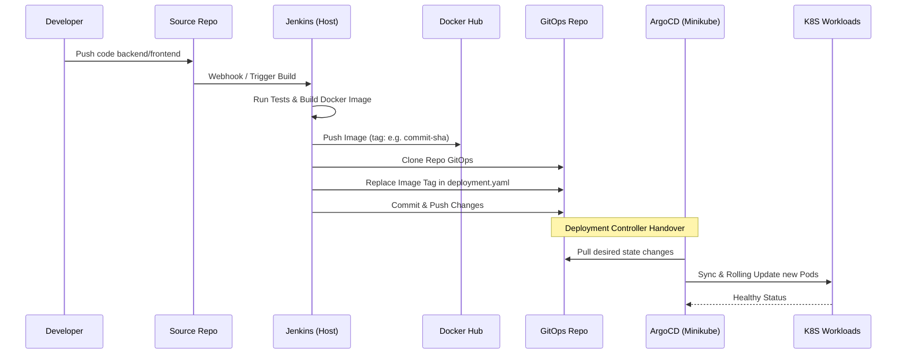

# Final Architecture 2.0 Presentation — KerjaDekat (Minikube + Jenkins CI/CD)

## 1. Ringkasan Eksekutif

Dokumen ini menjelaskan arsitektur final versi 2.0 proyek KerjaDekat yang dijalankan di lingkungan lokal menggunakan Minikube, disempurnakan dengan alur CI/CD yang terotomatisasi secara penuh. Desain ini mengikuti prinsip cloud architecture modern yang well-architected, secure-by-design, observable, dan scalable.

Pembaruan utama pada versi 2.0 ini adalah integrasi pipeline Continuous Integration (CI) menggunakan **Jenkins yang berjalan di Docker host**, sedangkan manajemen Continuous Deployment (CD) tetap mengacu pada prinsip GitOps menggunakan **ArgoCD di level *cluster* Minikube**. 

Tujuan utamanya adalah menyajikan arsitektur sistem cloud yang profesional, pemisahan layer secara bersih (Edge, Application, Data, Operations, Pipeline), dan eksekusi GitOps sejati dimana Jenkins bertugas membangun sistem (*build & push*) dan ArgoCD menyinkronkan infrastruktur (*sync*).

---

## 2. Tujuan Arsitektur

Arsitektur ini dirancang untuk memenuhi tujuan berikut:

1. **Full-stack Local Deployment:** Menjalankan seluruh stack secara lokal di Minikube, tanpa cloud load balancer publik / VPC.
2. **Production-like CI/CD:** Mengimplementasikan CI/CD dari *Source Control* hingga ke deployment dalam Kubernetes.
3. **Pemisahan Tanggung Jawab (Separation of Concerns):**
   - **Jenkins** berfungsi murni sebagai CI (test, build image, publish registry, update GitOps Repo).
   - **ArgoCD** berfungsi murni sebagai CD controller (sync manifest GitOps Repo ke cluster Kubernetes).
4. **Isolasi Service:** Frontend tidak boleh menjadi jalur langsung ke database; hanya Backend yang berbicara ke lapisan Data.
5. **Autoscaling:** Mendemonstrasikan skalabilitas menggunakan Horizontal Pod Autoscaler (HPA) saat mendapat *load test*.
6. **Observability:** Menyediakan monitoring terpusat untuk kesehatan pod dan metrik (Prometheus + Grafana).

---

## 3. Prinsip Desain yang Dipakai

### 3.1 Secure by Design & Least Privilege
Sistem dipisahkan menjadi beberapa layer dengan NetworkPolicy (batasan akses eksplisit). Database (PostgreSQL), Redis, dan RabbitMQ diisolasi secara internal dan hanya merespons *request* dari Backend.

### 3.2 Single Entry Point (API Gateway)
Seluruh trafik eksternal dilayani oleh Kong API Gateway, membuat batas yang tegas untuk manajemen routing dan *security*.

### 3.3 GitOps CI/CD Pattern
Repositori Git menjadi *Source of Truth*. Jenkins tidak mengeksekusi `kubectl apply` secara imperatif. Sistem berjalan deklaratif: Jenkins membangun *image*, melakukan validasi, lalu memperbarui tag *image* pada repositori GitOps. ArgoCD otomatis menarik status terbaru tersebut.

### 3.4 Host-Isolated CI (Jenkins Option C)
Jenkins sengaja dikeluarkan dari Minikube dan ditempatkan pada level selumbung host (Docker container standar). Hal ini mencegah Jenkins membebani resource *runtime application cluster* dan memudahkan manajemen persisten *build system*.

---

## 4. Arsitektur Logis Final

### 4.1 CI/CD & Pipeline Layer (External/Host)
- **Komponen:** Jenkins Container (Docker Host), Docker Hub (Registry), Source Git Repo, GitOps Repo.
- **Fungsi:** Mengambil *source code*, melakukan *testing*, mem-build *frontend* & *backend image*, dan mendorong ke Docker Hub. Jenkins memanipulasi GitOps repo untuk mengubah *image tag* versi terbaru.

### 4.2 Edge Layer (Cluster Minikube)
- **Komponen:** Kong API Gateway
- **Fungsi:** Menerima jaringan eksternal, dan mengarahkan ke layanan di Application Layer. 

### 4.3 Application Layer (Namespace: `kerjadekat`)
- **Komponen:** kerjadekat-frontend, kerjadekat-backend
- **Fungsi:** Mengolah logika bisnis (Backend) dan merender antarmuka pengguna (Frontend). HPA (*Horizontal Pod Autoscaler*) diberlakukan pada layer ini.

### 4.4 Data Layer (Namespace: `kerjadekat-infra`)
- **Komponen:** PostgreSQL + PostGIS, Redis, RabbitMQ
- **Fungsi:** Penyimpanan persisten, asinkron antrean (*queue*), dan *cache* dalam zona yang sangat terstruktur.

### 4.5 Operations Layer (Minikube & External)
- **Komponen:** ArgoCD, Prometheus, Grafana, Logging.
- **Fungsi:** Observabilitas (*metrics*), visualisasi (*dashboards*), dan sinkronisasi otomatis infrastruktur GitOps.

---

## 5. Flowchart Keseluruhan — Mermaid

```mermaid
flowchart TD
    subgraph EXTERNAL[External Services (Git & Registry)]
        SRC[Source Repo]
        GITOPS[GitOps Repo]
        REG[Docker Hub Registry]
    end

    subgraph HOST[Local Docker Host]
        J[Jenkins CI container]
    end

    subgraph K8S[Minikube Cluster]
        subgraph EDGE[Edge Zone]
            K[Kong API Gateway]
        end
        
        subgraph OPS_NS[Operations Zone]
            A[ArgoCD]
            P[Prometheus]
            G[Grafana]
        end

        subgraph APP_NS[Application Zone: kerjadekat]
            F[Frontend Pods]
            B[Backend Pods]
            HPA[HPA]
        end

        subgraph INFRA_NS[Data Zone: kerjadekat-infra]
            PG[PostgreSQL]
            R[Redis]
            MQ[RabbitMQ]
        end
    end

    %% CI / CD Path
    DEV[Developer] -->|Push Code| SRC
    SRC -->|Trigger| J
    J -->|Push Image| REG
    J -->|Commit YAML Image Tag| GITOPS
    A -->|Monitor Changes| GITOPS
    A -->|Apply Changes| APP_NS
    A -->|Apply Changes| INFRA_NS

    %% Request User Path
    U[User Load] -->|HTTP| K
    K -->|Route UI| F
    K -->|Route API| B
    F -.->|Prohibited| PG
    B -->|Query| PG
    B -->|Cache| R
    B -->|Event| MQ

    %% HPA and Monitoring
    HPA -->|Scale| F
    HPA -->|Scale| B
    P -->|Scrape| APP_NS
    P -->|Scrape| INFRA_NS
    G -->|Visualize| P
```

---

## 6. Flowchart CI/CD Detail



---

## 7. Batas Tanggung Jawab Resolusi GitOps (Jenkins vs ArgoCD)

Ini adalah prinsip integritas utama dari arsitektur versi 2.0:

*   **Jenkins Bertanggung Jawab Untuk:**
    *   Build, lint, test.
    *   Membuat *artefak/image* final.
    *   Memublikasikan artefak ke Docker Hub.
    *   Mengatur pembaruan (patch versi tag) ke GitOps Repository.
    *   *Jenkins TIDAK berinteraksi langsung dengan cluster Kubernetes/Minikube.*

*   **ArgoCD Bertanggung Jawab Untuk:**
    *   Menjadi *deployment controller* tunggal yang mendikte *state* akhir.
    *   Menarik rincian arsitektur / update terbaru dari GitHub dan merespons sinkronisasi deklaratif ke cluster.
    *   Memastikan setiap pembaruan infrastruktur terekam dengan jelas dalam Git (*Audit Trail*).

---

## 8. HPA dan Autoscaling (Demonstrasi k6)

Melalui simulasi beban (`k6-hpa-loadtest.js`), arsitektur dievaluasi untuk menunjukkan responsivitas.
- **Frontend** menggunakan skala 2 hingga 10 pods berdasarkan peningkatan metrik CPU.
- **Backend** berskala 2 hingga 6 pods.
- Request/second dijaga dalam rata-rata ~909 req/s tanpa menaikkan error rate (0%), menunjukkan keandalan komponen `Kong -> Frontend -> Backend`.

---

## 9. Security Baseline & Observability

- **NetworkPolicy (Zero-Trust Model):**
  Desain yang mengunci relasi. `kerjadekat-infra` yang berisi Postgre, Redis, dan RabbitMQ dienkapsulasi dari siapapun kecuali komponen backend yang sah. Secara desain ini secure-by-design. (Meskipun di level pembuktian Minikube CNI *default*, performa enforcement terkesan pasif, tapi desain ini seutuhnya menduplikasi level *production network policy*).
- **Monitoring (Prometheus & Grafana):**
  Metrik kesehatan untuk keseluruhan zona diambil dan dapat divisualisasikan pada *Grafana dashboards*. Ini menyediakan bukti numerik atas *scaling event* (HPA) saat uji stres berjalan.

---

## 10. Narasi Presentasi 2.0 (Untuk Diucapkan)

“Pada pembaruan arsitektur final proyek KerjaDekat versi 2.0, saya mengimplementasikan standar Production-like cloud system dengan perpaduan GitOps CI/CD yang kuat namun tetap berjalan secara optimal di lokal Minikube. 

Secara topologi, infrastruktur operasional cluster dipisah dalam empat garis pertahanan: Edge Layer (Kong Gateway), Application Layer (Frontend dan Backend), Data Layer (PostgreSQL, Redis, RabbitMQ yang diisolasi), serta Operations Layer (Prometheus, Grafana, ArgoCD).

Hal yang membedakan pada arsitektur versi ini adalah pipeline rilis berkelanjutannya (CI/CD). Saya mendesain **Jenkins sebagai Continuous Integration (CI)** yang berada di Host secara terpisah dari Minikube untuk efisiensi beban. Saat kode baru di-push, Jenkins otomatis memeriksa, mem-build, dan mem-push *image container* ke Docker Hub, lalu Jenkins sekadar akan me-replace konfigurasi 'image tag' pada *GitOps Repository*. 

Di sisi lain, **ArgoCD berfungsi sebagai Deployment Controller sejati (CD)**. ArgoCD berada di dalam cluster, mengendus perubahan pada GitOps Repository, dan otomatis menyelaraskan *pod workloads* agar cocok dengan konfigurasi mutakhir tersebut tanpa campur tangan perintah *execute* manual (*kubectl apply*). Batas pemisahan ini membuat eksekusi rilis KerjaDekat tertata selayaknya perusahaan level enterprise: aman (*zero trust Network Policy*), bisa terlacak di Git (GitOps), dan otomatis menskalakan layanannya saat menerima lalu-lintas tinggi berkat *Horizontal Pod Autoscaler* yang dipandu pantauan metrik Prometheus. Walaupun hanya berjalan di simulasi Minikube lokal, ini adalah landasan ideal dan robust bagi infrastruktur *Cloud Native*.”
